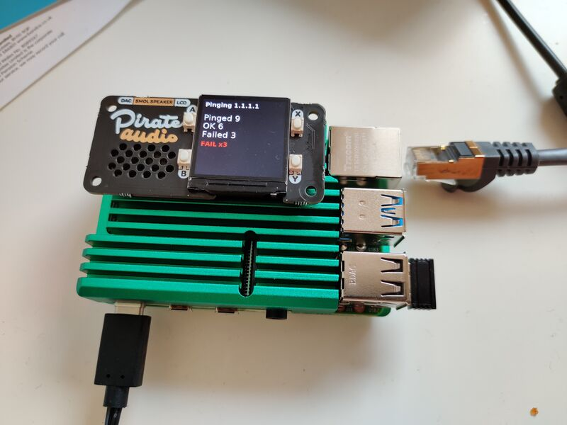

# pinger

This project aims to monitor your internet connection using a cheap
Raspberry Pi with an attached display (ST7789).



## Background

During the first lockdown my ISP had trouble holding a stable connection so I
wrote this script just to keep an eye on things. I could quickly tell if my
connection dropped just by looking at the Raspberry PI instead of having to
manually open up Google to check.

## Hardware used

- [Raspberry Pi]. I've used a Raspberry Pi 4 but older generations should work
just as well.
- [Pimoroni Pirate Audio HAT]. This HAT has a speaker and a display.

[Raspberry Pi]: https://amzn.to/3pX3a9D
[Pimoroni Pirate Audio HAT]: https://amzn.to/3EWlupV

## Software used

Python 3.4+. Needs to have support for `asyncio`. For libraries used, see [requirements.txt].

## Running it

Just copy everything on your Raspberry Pi, create a virtual env, install
dependencies with pip and run with

```sh
python3 -m pinger
```

[requirements.txt]: ./requirements.txt
